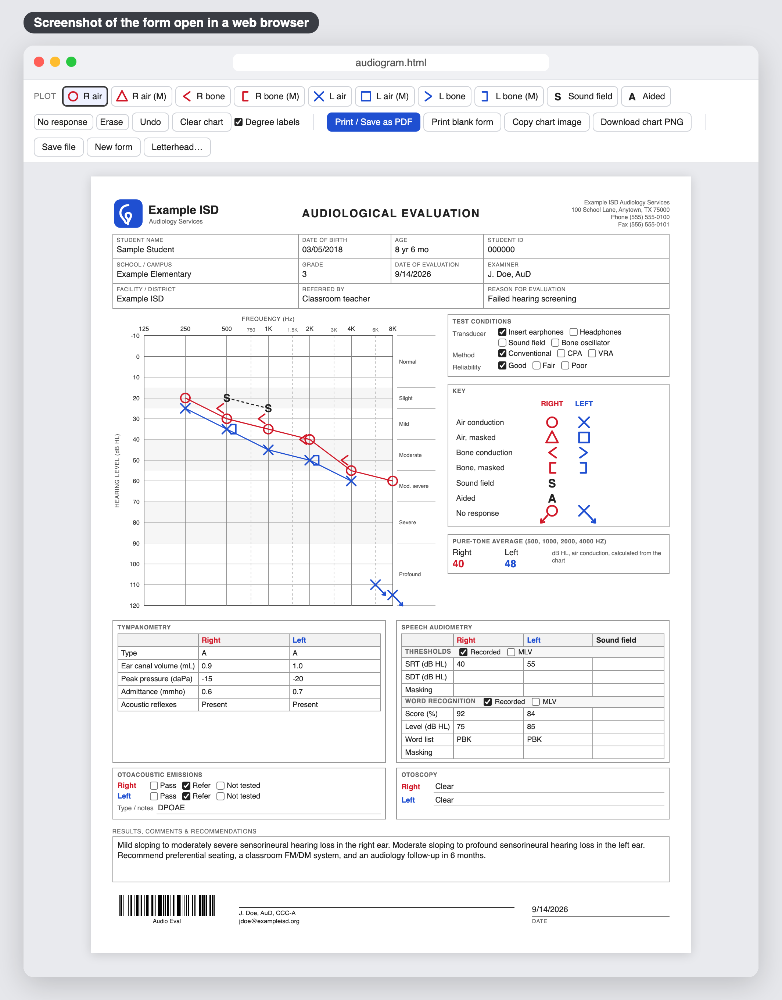
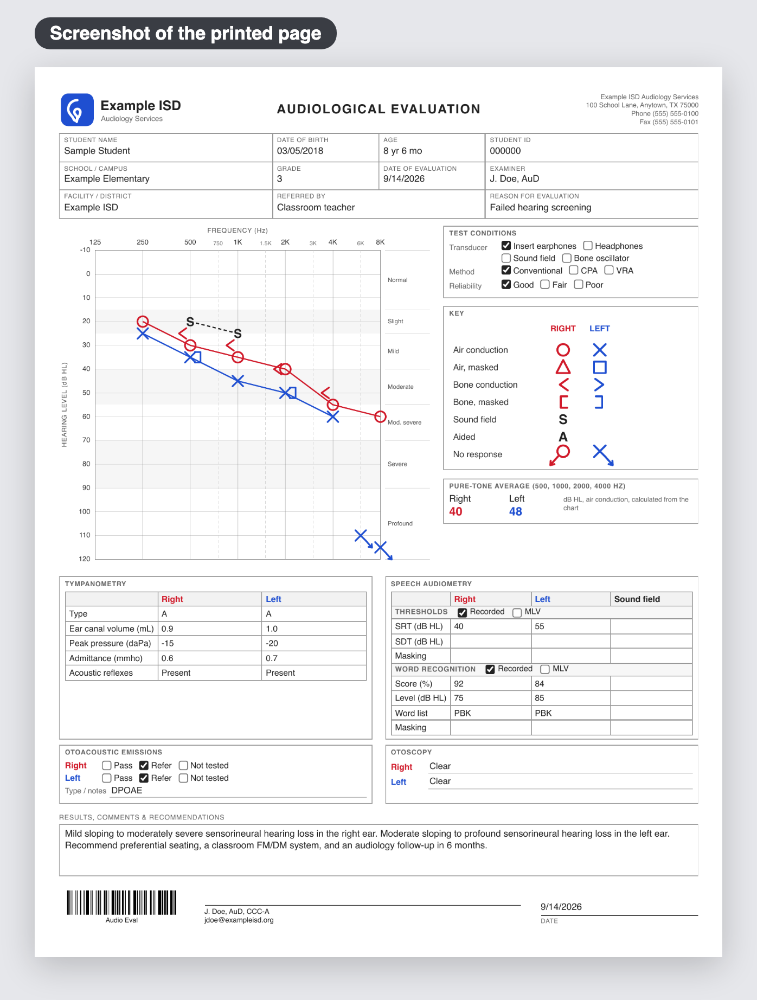

# Audiology Forms

Free forms for audiologists. Each one is a single file that opens in any web browser (Chrome, Edge, Safari, Firefox), fills in on screen, and prints to a clean PDF. Nothing to install, no account, no subscription, and nothing you type leaves your computer.

They were made for educational audiologists who needed editable forms and couldn't find good ones to buy.

| Form | What it's for | Download |
| --- | --- | --- |
| **Audiogram** | Pure-tone audiogram with click-to-plot chart, speech audiometry, tympanometry, OAEs, and otoscopy. One page. | **[audiogram.html](https://github.com/citizenkade/audiology-forms/releases/latest/download/audiogram.html)** |
| **ABR report** | Auditory brainstem response evaluation with measured and estimated thresholds, an audiogram drawn from the estimates, and page two for OAEs, immittance, interpretation, and recommendations. Two pages. | **[abr-report.html](https://github.com/citizenkade/audiology-forms/releases/latest/download/abr-report.html)** |

This page is a description of the forms, with download links and some pictures. The forms themselves are the files you download.

## How to download a form

1. Click its download link in the table above.
2. Your browser saves the file to your Downloads folder. If it asks whether to keep the file, choose Keep.
3. Open your Downloads folder and double-click the file. It opens in your browser, ready to use.

Move the file wherever you like: your desktop, Google Drive, a USB stick. It works from anywhere, and you can email it to a colleague.

If a link doesn't work for you, there's a second way: click the green **Code** button near the top of this page, choose **Download ZIP**, then unzip it and open the form you want.

## Audiogram

These are pictures, not the form itself. Clicking on them won't fill anything in. Clicking a picture downloads the real form, same as the link above.

Filling it in on screen. You pick a symbol from the toolbar at the top, click on the chart, and the symbol snaps into place.

What comes out of the printer, or the PDF you save. One US Letter page.

How to use it:

- **Type** into any box. The age fills in on its own from the date of birth and evaluation date.
- **Plot** by choosing a symbol in the toolbar (R air, L bone, and so on) and clicking on the chart. Symbols snap to the nearest frequency and 5 dB step. Air-conduction thresholds connect automatically.
- **No response**: click the "No response" button first, then plot. The symbol gets an arrow. Click the button again to turn it off.
- **Fix a mistake**: click again at the right level to move a symbol, right-click a symbol to remove it, or use Undo.
- **Pure-tone average** (500, 1000, 2000, and 4000 Hz) calculates itself for each ear once all four thresholds are plotted.
- **Speech audiometry** has separate rows for SRT and SDT, masking for thresholds and for word recognition, and Recorded / MLV checkboxes for each.
- **Print / Save as PDF** opens your print dialog. Choose "Save as PDF" as the printer to get a PDF file.
- **Print blank form** prints an empty copy for hand-plotting.
- **Copy chart image** puts a picture of the chart and key on your clipboard, ready to paste into a report or email.
- **Save file** downloads a copy of the form with everything filled in, named after the student and date. Open that copy later to see or change the evaluation. Your original stays blank, so keep it as your master.

## ABR report

Works the same way: one file, opens in any browser, prints to a two-page PDF. What is different from the audiogram form:

- **Thresholds are typed, not clicked.** Enter ABR thresholds in dB nHL for click and toneburst stimuli, by ear and by air or bone conduction. Write `35*` when the lowest level tested had a response, and `NR 90` for no response at 90.
- **Estimated behavioral thresholds** (dB eHL) fill in on their own from the measured table, using a correction for each stimulus. The corrections are editable and the printout states which ones were used. Untick "Calculate from measured" to type the estimates yourself.
- **The audiogram draws itself** from the estimated table.
- **Page 2** holds otoacoustic emissions, immittance, a summary of hearing status, the interpretation, a recommendations checklist, and the signature.

## Your letterhead

The audiogram form has a **Letterhead…** button in the toolbar that puts your logo, office details, and name on every printout. You can set a logo, up to four lines of office contact information, your name and credentials for under the signature line, and a document identifier that prints as a barcode for records systems that file by type. Each is optional.

The letterhead prints right away, but the form can't save it into itself. To keep it, click **Save master copy** in the panel. That downloads a blank `audiogram.html` with your letterhead built in. Use that file from now on, and give it to colleagues so everyone prints the same letterhead. Files you save with student information carry the letterhead too.

## Privacy

Nothing you type leaves your computer. There is no server, no account, and no automatic saving. Student and patient information exists only in the PDFs and files you choose to save.

## Questions and requests

If something is wrong or you want a change, click the **Issues** tab at the top of this page and describe it. You'll need a free GitHub account to post there. Or reply on the Facebook post where you found this.

## License

MIT. Free to use, share, and modify.
