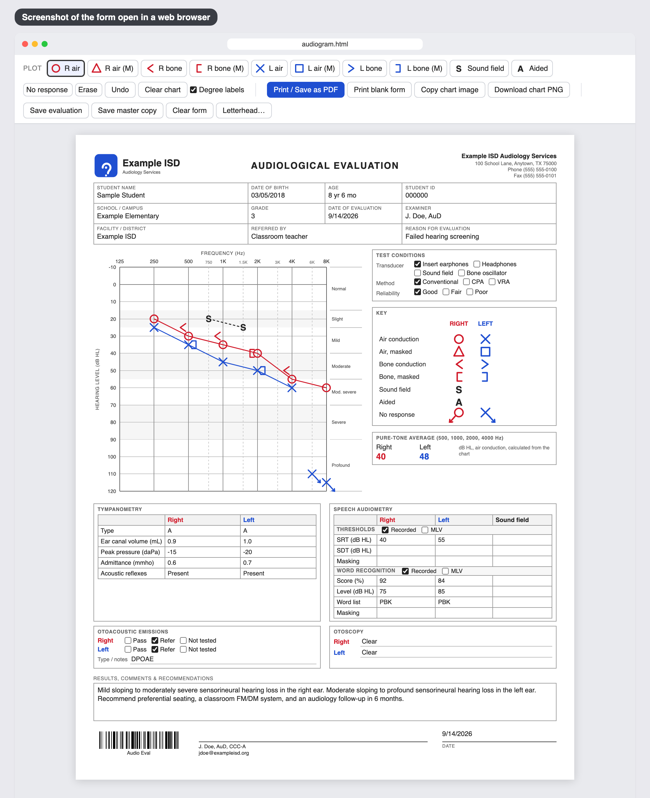
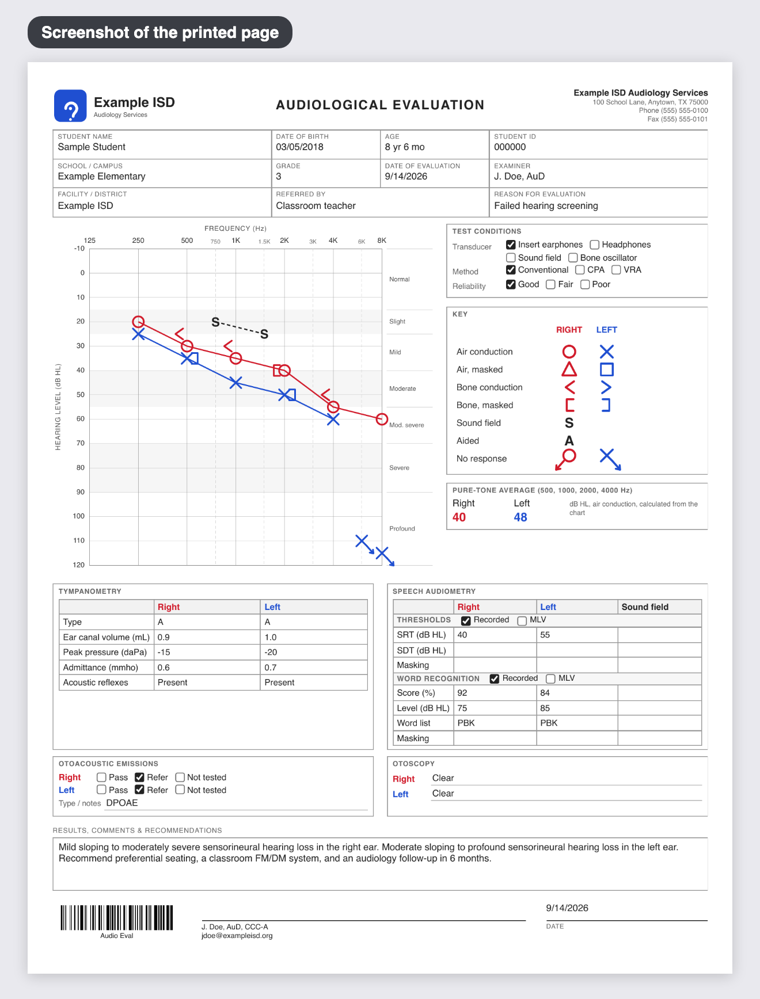
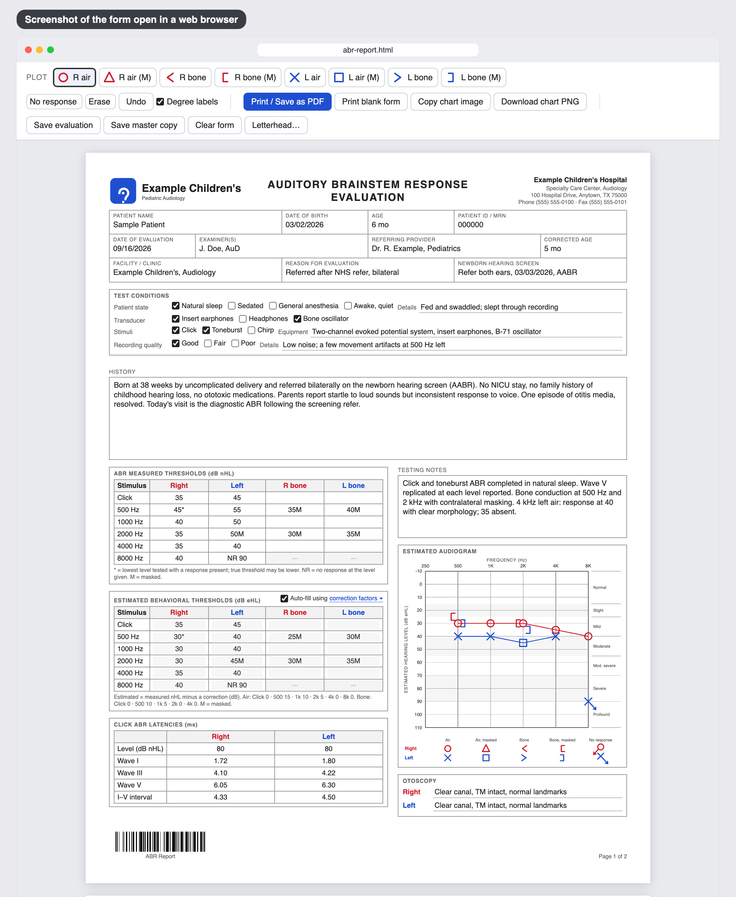
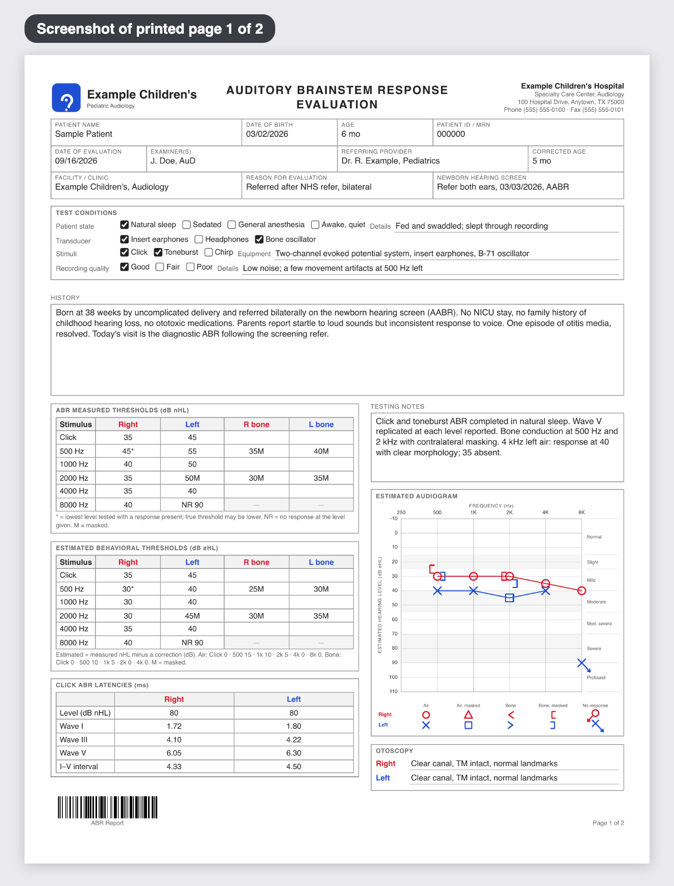
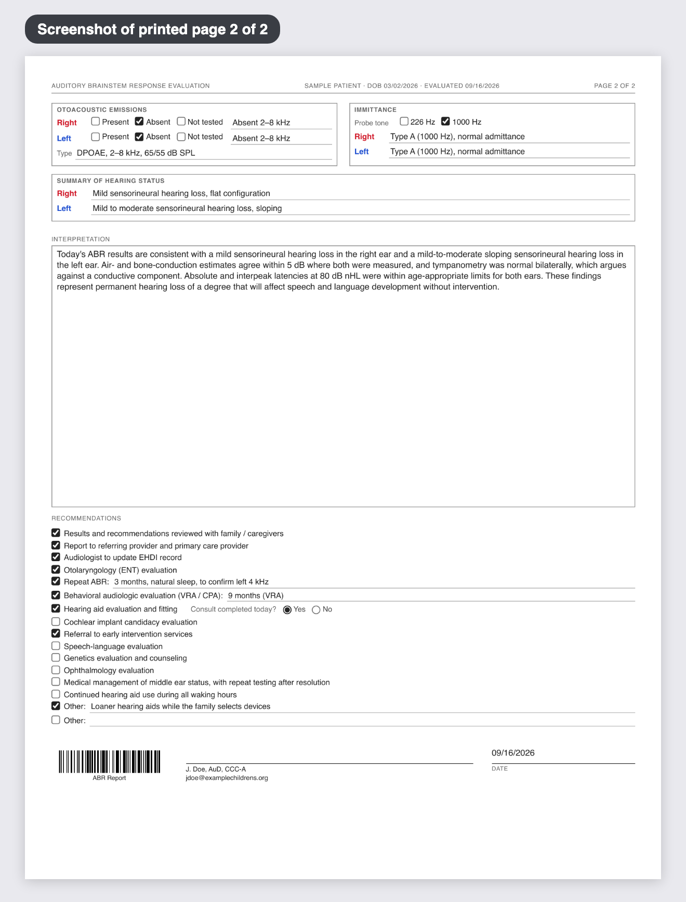
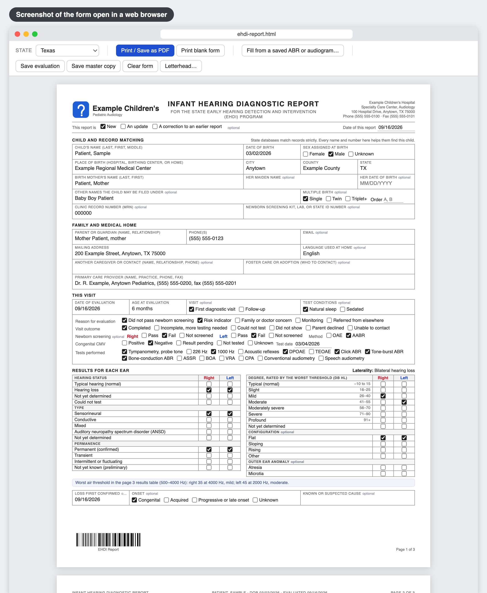
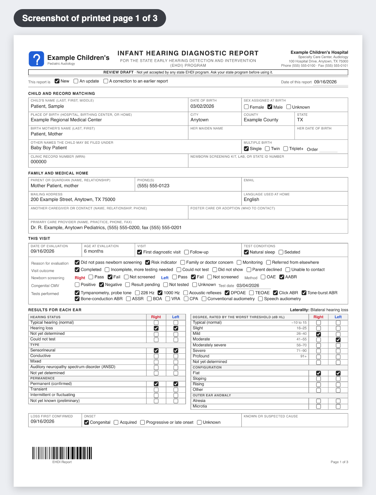
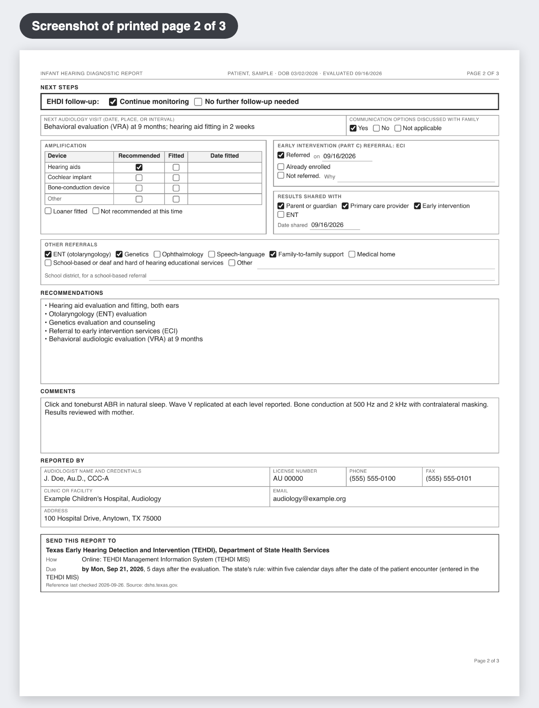
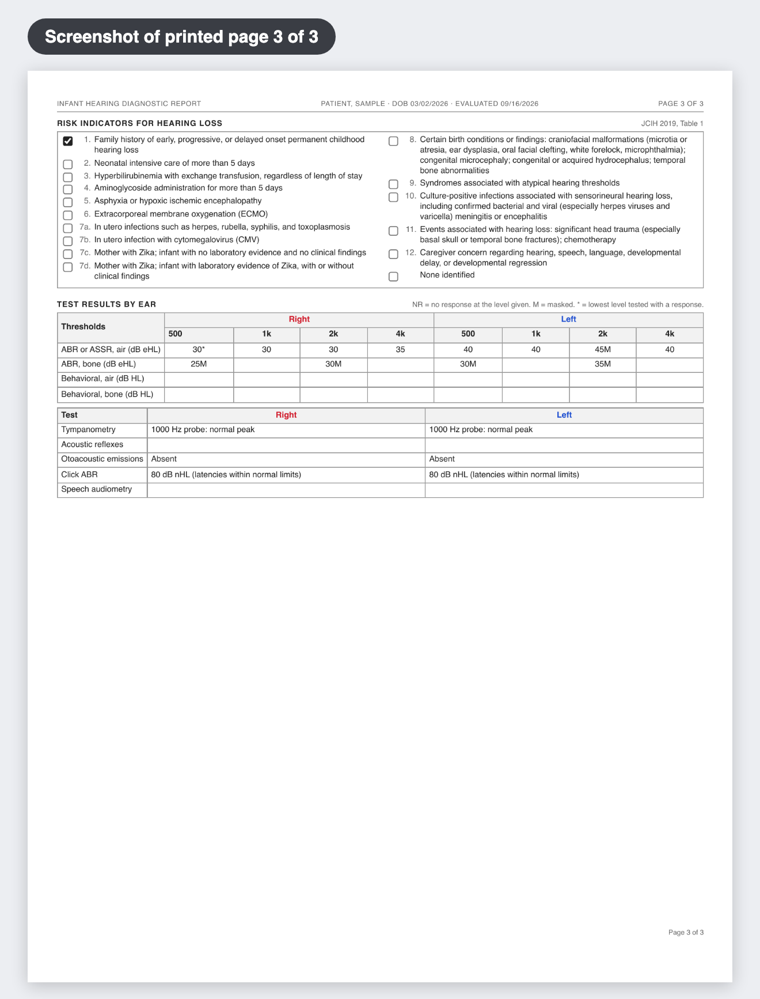

# Audiology Forms

Free forms for audiologists. Each one is a single file that opens in any web browser (Chrome, Edge, Safari, Firefox), fills in on screen, and prints to a clean PDF. Nothing to install, no account, no subscription, and nothing you type leaves your computer.

They were made for educational audiologists who needed editable forms and couldn't find good ones to buy.

| Form | What it's for | Download |
| --- | --- | --- |
| **Audiogram** | Pure-tone audiogram with click-to-plot chart, speech audiometry, tympanometry, OAEs, and otoscopy. One page. | **[audiogram.html](https://github.com/citizenkade/audiology-forms/releases/latest/download/audiogram.html)** |
| **ABR report** | Auditory brainstem response evaluation with measured and estimated thresholds, an audiogram drawn from the estimates, and page two for OAEs, immittance, interpretation, and recommendations. Two pages. | **[abr-report.html](https://github.com/citizenkade/audiology-forms/releases/latest/download/abr-report.html)** |
| **EHDI report** *(review draft)* | **Not yet accepted by any state EHDI program; ask yours before using it.** Infant hearing diagnostic report for your state's Early Hearing Detection and Intervention (EHDI) program. One standard report for any state, with where to send it and by when for all 50 states and DC. Two pages, plus an optional third. | **[ehdi-report.html](https://github.com/citizenkade/audiology-forms/releases/latest/download/ehdi-report.html)** |

This page is a description of the forms, with download links and some pictures. The forms themselves are the files you download.

## How to download a form

1. Click its download link in the table above.
2. Your browser saves the file to your Downloads folder. If it asks whether to keep the file, choose Keep.
3. Open your Downloads folder and double-click the file. It opens in your browser, ready to use.

Move the file wherever you like: your desktop, Google Drive, a USB stick. It works from anywhere, and you can email it to a colleague.

If a link doesn't work for you, there's a second way: click the green **Code** button near the top of this page, choose **Download ZIP**, then unzip it and open the form you want.

## Audiogram

These are pictures, not the form itself. Clicking on them won't fill anything in. Clicking a picture downloads the real form, same as the link above.

Filling it in on screen. You pick a symbol from the toolbar at the top, click on the chart, and the symbol snaps into place.

What comes out of the printer, or the PDF you save. One US Letter page.

How to use it:

- **Type** into any box. The age fills in on its own from the date of birth and evaluation date.
- **Plot** by choosing a symbol in the toolbar (R air, L bone, and so on) and clicking on the chart. Symbols snap to the nearest frequency and 5 dB step. Air-conduction thresholds connect automatically.
- **No response**: click the "No response" button first, then plot. The symbol gets an arrow. Click the button again to turn it off.
- **Fix a mistake**: click again at the right level to move a symbol, right-click a symbol to remove it, or use Undo.
- **Pure-tone average** (500, 1000, 2000, and 4000 Hz) calculates itself for each ear once all four thresholds are plotted.
- **Speech audiometry** has separate rows for SRT and SDT, masking for thresholds and for word recognition, and Recorded / MLV checkboxes for each.
- **Print / Save as PDF** opens your print dialog. Choose "Save as PDF" as the printer to get a PDF file.
- **Print blank form** prints an empty copy for hand-plotting.
- **Copy chart image** puts a picture of the chart and key on your clipboard, ready to paste into a report or email.
- **Save evaluation** downloads a copy of the form with everything filled in, named after the student and date. Open that copy later to see or change the evaluation. Your original stays blank, so keep it as your master.
- **Sign electronically**, under the signature line, signs the report on screen with your typed name or an image of your signature. See [Signing electronically](#signing-electronically) below.
- **Clear form** empties every field, ready for the next student.

## ABR report

Again, these are pictures; clicking one downloads the real form.

Filling it in on screen. Thresholds go into the measured table, and the estimated table and the audiogram follow. You can also plot on the chart, and the tables follow that.

What comes out of the printer. Two US Letter pages.

It works the same way as the audiogram: one file, opens in any browser, prints to PDF. What is different:

- **Thresholds are typed or plotted.** Enter ABR thresholds in dB nHL for click and toneburst stimuli, by ear and by air or bone conduction. Write `35*` when the lowest level tested had a response, `NR 90` for no response at 90, and add `M` for a masked threshold (`45M`, `NR 90M`). Or pick a symbol in the toolbar and click on the chart, the same as the audiogram form; the click fills in the matching table cell. Clicking a symbol that is already there switches it between masked and unmasked.
- **Tab moves down the column**, so you can enter the whole right ear, then the left, then right bone, then left bone.
- **Estimated behavioral thresholds** (dB eHL) fill in on their own from the measured table while "Auto-fill using correction factors" is ticked. Click *correction factors* to see or change them: one set for air conduction, one for bone. The printout states which ones were used. Untick auto-fill to type the estimates yourself.
- **The audiogram draws itself** from the estimated table, with masked symbols where you marked them.
- **Page 1** also holds the history, testing notes, click latencies, and otoscopy. **Page 2** holds otoacoustic emissions, immittance, a summary of hearing status, the interpretation, a recommendations checklist, and the signature. Two recommendations ask a follow-up question when ticked: whether a hearing aid consult was completed today, and whether a cochlear implant referral was placed today.
- **Correction factors are saved with your letterhead.** Save a master copy (below) and a colleague who opens it gets the same corrections.

## EHDI report

> [!WARNING]
> **Review draft. No state EHDI program has accepted this report yet.** Ask your state program before sending results on it. Until your program says yes, keep reporting on your state's own form or online system.
>
> It's shared now so EHDI programs and audiologists can review it. Every printed page says it's a review draft. Comments, and the list of states that accept it, are in [issue #1](https://github.com/citizenkade/audiology-forms/issues/1).
>
> **For EHDI programs:** a [one-page handout (PDF)](docs/ehdi/ehdi-report-handout.pdf) explains the report and what we're asking. Please pass it along to other programs.

These are pictures too; clicking one downloads the real form.

Filling it in on screen. Choose your state in the toolbar, then work down the page. Most answers are checkboxes, with Right and Left columns for each ear.

What comes out of the printer. Pages 1 and 2 always print. Page 3 prints only when you add one of its optional sections.

Every state collects infant diagnostic results on its own form, with its own labels and order. This is one standard report that covers what nearly every state form asks for. It follows JCIH 2019 and ASHA terms. It works alongside your state's form or online system; it doesn't replace them. Some states accept your own report, and others want their own form or portal. The printout can also be the sheet you type from.

- **Page 1** is the child and what you found. It has the child's name, birth details, and the record-matching details state databases search by: other names, the birth mother's name, and record numbers. Then the family, primary care provider, this visit, tests performed, and the results for each ear.
- **Results for each ear** are hearing status, type, permanence, and degree. Degree uses the ASHA bands, printed with their dB ranges, and is rated by the worst threshold from 500 to 4000 Hz. Every question has an honest "not yet determined" choice.
- **Page 2** opens with the answer the state needs most: **EHDI follow-up: continue monitoring, or no further follow-up needed**. Then the next visit, amplification, early intervention referral, other referrals, who the results were shared with, recommendations, comments, and who reported.
- **Page 3 is optional.** Click **+ Add** at the bottom of the form for any of three sections: risk indicators (JCIH 2019), test results by ear, and parent permission to share results. Remove a section and it stops printing.
- **Send this report to**, at the bottom of page 2, shows your state program, how to send (fax, email, or online system), and the deadline. The due date is worked out from the date of evaluation. The entries come from each state's own published sources, with the source and the date last checked. They can go out of date. If yours is wrong, click **Fix or update these details** and correct it, then save a master copy to keep the change. Please also tell us through Issues so we can fix it for everyone.
- **Fill from a saved ABR or audiogram…** reads an ABR report or audiogram you saved with **Save evaluation**. It fills in the name, dates, tests performed, thresholds, and, from the ABR, the recommendations and referrals. It rates the degree for you to check. It fills only empty boxes, so nothing you typed is overwritten, and **Undo fill** puts the form back.
- **Your details are saved in the master copy.** Save a master copy (below) and it remembers the Reported by section and your state, as well as your letterhead.
- **There is no signature line.** A few states ask for one; the review behind this form decided to leave it off.

## Your letterhead

All three forms have a **Letterhead…** button in the toolbar that puts your logo, office details, and name on every printout. You can set a logo, up to four lines of office contact information, your name and credentials for under the signature line, and a document identifier that prints as a barcode for records systems that file by type, on the first page, the last page, or every page. Each is optional. The EHDI report has no signature line, so its panel skips the name.

If you work at more than one clinic, click **Add another location** in the panel and enter each one. A **Location** menu then appears above the page, so you can pick which clinic prints on each evaluation. The first location is the default, and a saved evaluation remembers the one it used. The first line of each location is the clinic name, which prints in bold. If several locations share a clinic name, put the site on the second line: the menu shows it next to the name so you can tell them apart.

The letterhead prints right away, but the form can't save it into itself. To keep it, click **Save master copy**, in the toolbar or in the panel. That downloads a blank copy of the form (`audiogram.html`, `abr-report.html`, or `ehdi-report.html`) with your letterhead built in. The ABR report's copy also keeps your correction factors. The EHDI report's copy also keeps your Reported by details, your state, and any fixes to its sending details. Use that file from now on, and give it to colleagues so everyone prints the same letterhead. Evaluations you save carry the letterhead too.

## Signing electronically

The audiogram and the ABR report can be signed on screen, so you don't have to print, sign, and scan. Under the signature line:

- **Sign electronically** prints "Electronically signed by", your name, and the date and time on the line. The name comes from the letterhead's signer line, or from Printed name. A long name and credentials wrap onto a second line. A saved evaluation keeps this signature.
- **Use a signature image…** takes a scan or photo of your signature (PNG or JPG). The form removes the paper background and trims it to the ink, then signs the report with it. While the image is loaded, the button reads **Sign with your signature image**, so the next report takes one click. Your name and credentials from the letterhead still print under the line.

Your signature image is never saved in any file. Not in a saved evaluation, not in a master copy. Those files get shared and copied, and an image inside them would let anyone sign a report as you. The image stays only until you close the page, so load it again next time.

A signature is for one report. Changing anything on the report after signing removes it (the date beside it doesn't count). Clear form removes it, and blank forms never print with one.

The form puts the signature on the page. Your clinic, hospital, or district decides whether it accepts an electronic or image signature on a report, so check their policy before you rely on it.

## Privacy

Nothing you type leaves your computer. There is no server, no account, and no automatic saving. Student and patient information exists only in the PDFs and files you choose to save. The EHDI report doesn't send anything to your state; you send it yourself.

## Questions and requests

If something is wrong or you want a change, click the **Issues** tab at the top of this page and describe it. You'll need a free GitHub account to post there. Or reply on the Facebook post where you found this.

## License

MIT. Free to use, share, and modify.
